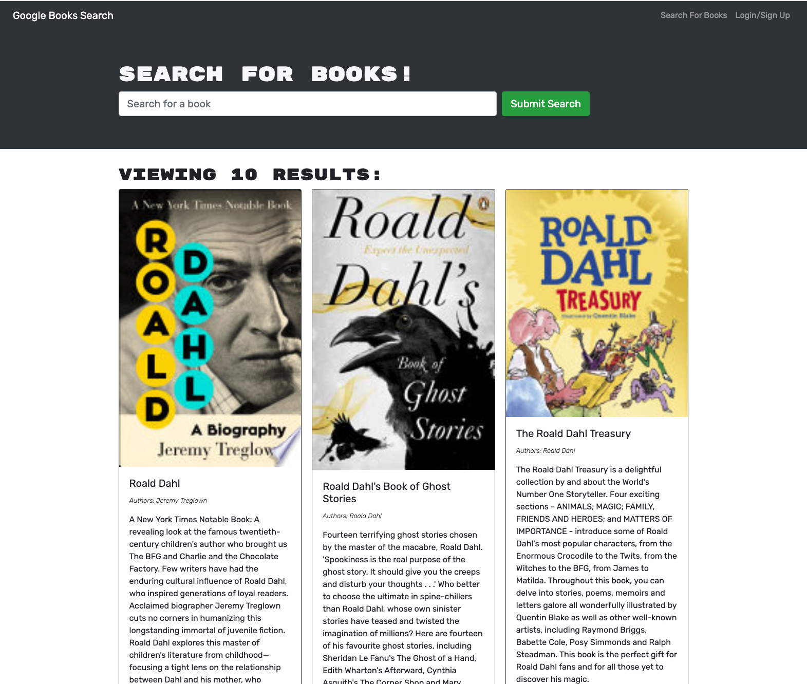

# Booksearch

## Description
I tried to refactor a fully functioning booksearch website that used an API to find and save books to a user's account.  
I rewrote it using Apollo to write typeDefs, resolvers, queries, and mutations.  I got a lot of it working like this.  I'm still having issues with the saveBook function.  It's saying "invalid token".  If anyone has ideas how to fix this, please connect with me on LinkedIn.  Thank you! 

View the app here: [Link to Deployed App](https://murmuring-springs-45563.herokuapp.com/).

A preview of the app:

## Table of Contents
* [Installation](#installation)
* [Tests](#tests)
* [Questions](#questions)

## Installation
To install necessary dependencies, run the following command:
npm i

## Tests
To run tests, run the following command: 
npm test

## Questions
If you have any questions about the repo, open an issue or contact me directly on LinkedIn.
You can find more of my work at github.com/suzannaakins.
